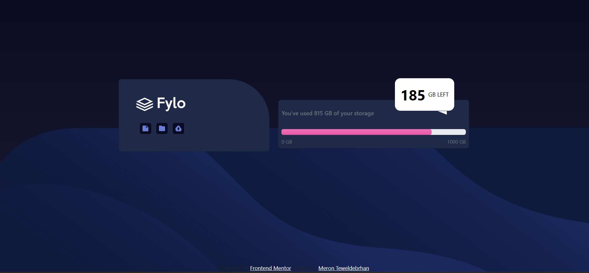

# Fylo Storage Dashboard

## Overview

### The challenge

The goal was to create a responsive storage dashboard for Fylo, featuring a logo panel with interactive icons, a storage usage panel with a gradient progress bar, and a floating bubble showing remaining storage. The primary challenge was overcoming **Bootstrap's limitations** in styling properties, which required extensive custom CSS to achieve the desired design, including rounded corners, gradients, and pseudo-elements.

### Screenshot



### Links

- Solution URL: [Add solution URL here](sslo)
- Live Site URL: [Add live site URL here](https://mtfylostoragesba.netlify.app)

## My process

### Built with

- **HTML5**: Semantic structure for the dashboard.
- **Bootstrap 5.3**: CSS framework for layout and responsive design.
- **Custom CSS**: Extensive styles to overcome Bootstrap’s limitations.
- **Font Awesome**: Icons for file, folder, and upload actions.
- **Google Fonts (Raleway)**: For consistent typography.
- **SVG**: Custom logo rendering.

### What I learned

- **Bootstrap Limitations**: Discovered that Bootstrap’s utility classes lack support for complex styling like gradients, custom pseudo-elements, and specific border-radius variations, requiring custom CSS.
- **Custom CSS Integration**: Learned to combine Bootstrap’s grid and utilities with custom CSS for precise control over progress bar styling, pseudo-elements, and responsive positioning.
- **Progress Bar Styling**: Mastered browser-specific pseudo-elements (::-moz-progress-bar`) to create a gradient progress bar.
- **Responsive Design**: Used Bootstrap’s grid system alongside custom media queries to ensure the GB left bubble adapts seamlessly across devices.

To see how you can add code snippets, see below:

```html
div class="row justify-content-center  align-items-center">
           
        <div class=" col-12 col-md-3 col-lg-4  mb-5">
          <div class="card card-custom p-5 text-center rounded-6 ">
            <div class="d-flex align-items-center gap-2 mb-3 fw-bold fs-4">
              
            </div>
            <div class=" d-flex justify-content-start gap-1 mb-0 mt-3">
              
              
              
            </div>
          </div>
        </div>
```
```css
.remaining::after {
            content: '';
            position: absolute;
            bottom: -10px;
            right: 20px;
            border-left: 25px solid transparent;
            /* border-right: 0px solid transparent; */
            border-top: 10px solid white;
        }
```
### Continued development

- Explore Bootstrap’s customization options (e.g., Sass variables) to reduce reliance on custom CSS.
- Add JavaScript for dynamic storage updates or icon interactions.
- Improve accessibility with ARIA attributes for the progress bar and icons.
- Optimize custom CSS by consolidating repetitive styles and leveraging CSS variables.

### Useful resources

- [Bootstrap 5 Docs](https://getbootstrap.com/docs/5.3/) - Guided layout and responsive utilities.
- [MDN Web Docs: <progress>](https://developer.mozilla.org/en-US/docs/Web/HTML/Element/progress) - Essential for styling the progress bar.
- [Font Awesome](https://fontawesome.com) - Quick icon integration.
- [Google Fonts: Raleway](https://fonts.google.com/specimen/Raleway) - Typography reference.

## Author

- **Name**: Meron Teweldebrhan
- **Frontend Mentor**: [ My Frontend Mentor profile](https://www.frontendmentor.io/profile/MeronTeweldebrhan)
- **GitHub**: [ My GitHub profile ](https://github.com/MeronTeweldebrhan)

## Acknowledgments

- Thanks to [Frontend Mentor](https://www.frontendmentor.io) for the challenge inspiration.
- I would like to thank the Per Scholas organization and Instructor Abraham E. Tavarez for their dedication to teaching and guiding us through this learning journey.
